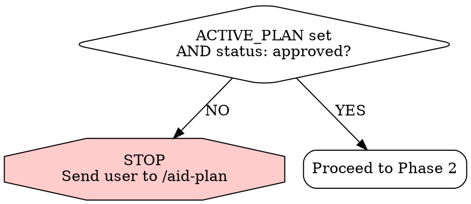
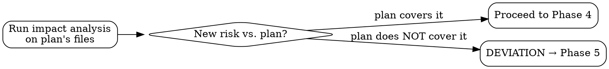
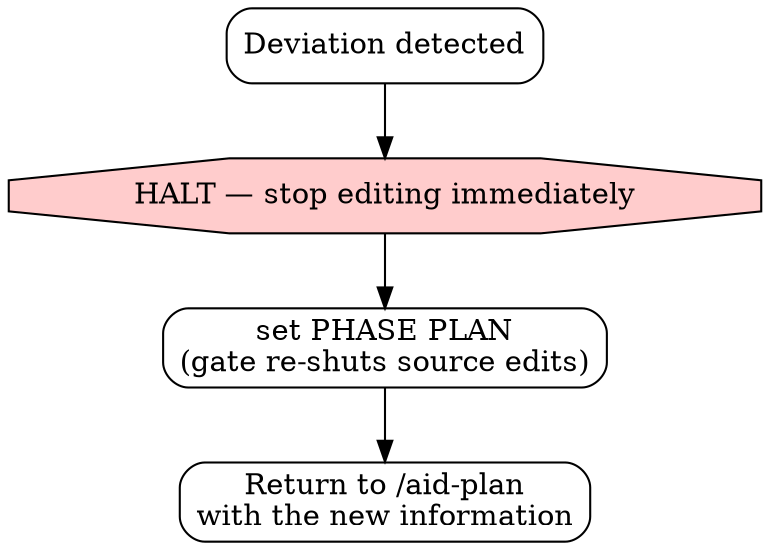

# Execute — Implement the Approved Plan, Exactly

You are executing a BEHAVIORAL CONTRACT. Every phase is MANDATORY.
EXECUTE implements the approved plan — EXACTLY. Not a line more, not a decision extra.
The plan is the authority. If reality disagrees with the plan, the plan wins until the user changes it.

This is the RIPER EXECUTE phase. It is the ONLY phase allowed to touch source code,
and it is allowed to do so ONLY because the user approved a plan. The PreToolUse gate
(`riper-gate.sh`) enforces this mechanically — but this skill checks and explains it too,
because a contract you understand is stronger than a wall you bump into.

EXECUTE has no Quick/Full mode — it implements the approved plan as written.

---

## Phase 1: Load the Approved Plan (MANDATORY — the gate before all gates)

You do not start coding from memory of the conversation. You start from the saved plan.

1. Read the workflow cursor:
   ```bash
   bash .claude/hooks/scripts/riper-state.sh get ACTIVE_PLAN
   bash .claude/hooks/scripts/riper-state.sh get PHASE
   ```
2. Resolve `ACTIVE_PLAN` to a file under `.aid/`. Store and read it in the SAME bare
   form aid-plan writes — `memory/YYYY-MM-DD-[slug].md` (resolved relative to `.aid/`).
   Read that plan file in full — frontmatter, approach, and checklist. (Using the same
   bare form keeps this skill's check and the gate hook's check in agreement.)
3. Confirm the plan is APPROVED. The plan's frontmatter MUST contain:
   ```
   status: approved
   ```
   `status: planned` is NOT approved. A plan with no `ACTIVE_PLAN` set is NOT approved.



**If there is no approved plan — STOP. Do not write any code.** Tell the user verbatim:

```
[AID·EXECUTE] No approved plan found.

EXECUTE may only implement a plan the user has approved.
  ACTIVE_PLAN: [value or <unset>]
  status:      [value or <no plan file>]

Run /aid-plan, choose an approach, and approve it. Approval stamps the plan
'status: approved' and arms the EXECUTE gate. Then run /aid-execute again.
```

Then end. Do NOT set PHASE to EXECUTE. Do NOT attempt a workaround. The gate hook will block source edits anyway — but you must not even try. STOP is the correct outcome here.

If the helper script is absent (older install): still require a saved `.aid/memory/` plan with `status: approved` that you can read. No approved plan on disk → STOP. The discipline does not depend on the script existing.

---

## Phase 2: Enter EXECUTE Phase (MANDATORY)

Only after Phase 1 confirms an approved plan:

1. Set the phase so the gate unlocks source edits for this approved plan:
   ```bash
   bash .claude/hooks/scripts/riper-state.sh set PHASE EXECUTE
   ```
2. Print the runtime banner once at the start of your work:
   ```
   AID · EXECUTE — implementing: [plan feature name]
   Plan: .aid/memory/YYYY-MM-DD-[slug].md (status: approved)
   ```

From this point you are authorized to edit source — but ONLY the files the plan named, ONLY to do what the checklist says. The authorization is scoped to the plan, not open-ended.

### Phase 2.5: Jira Sync — execute started (conditional — fail-open)

Follow `.claude/rules/aid-jira.md`. Skip silently if `jira` is disabled/absent or the MCP is
unavailable — Jira NEVER blocks execution.
- **Event:** `execute_started`
- **Default transition:** *null* — comment-only ("Plan Approval" already moved the ticket).
- **Comment payload:** "EXECUTE started — plan `<path>`, N items".

---

## Phase 3: Pre-Execute Diligence — Blast Radius (MANDATORY when risk is non-trivial)

Before touching shared code, run the impact analysis on the plan's files. Skip this ONLY if the plan is a trivial, single-file, well-tested change with no downstream consumers.

1. Take the `files:` list from the plan's frontmatter.
2. Run the `impact` (aid-impact) analysis against those files: direct dependents, downstream systems, past incidents in `.aid/memory/`, test coverage, customer-specific config. **Run aid-impact's ANALYSIS only — do NOT trigger its separate `type: impact-analysis` memory save.** Fold the blast-radius result into THIS execution's progress record (Phase 6) so there is one record per execution, not two.
3. If impact analysis surfaces a risk the plan did NOT account for — a downstream consumer the plan ignores, a schema contract the plan breaks, a past incident in the exact area — that is a DEVIATION. Go to Phase 5. Do not "just handle it."



Record the risk score and any blast-radius notes — they go into the progress record in Phase 6.

---

## Phase 4: Execute the Checklist — Item by Item (MANDATORY)

Work the approved checklist in order. One item at a time. No skipping ahead, no batching unrelated items into a vague "done."

For EACH checklist item:

1. State which item you are implementing (number + title).
2. Make EXACTLY the change the item specifies — in EXACTLY the files the item names.
3. Verify the item per its `Verify:` line (compile check, grep, read-back — not "looks right").
4. Mark it complete and report status:

```markdown
- [x] **N. [item title]**
  Done: [what you actually changed — file:area]
  Verified: [how you confirmed it — the Verify step result]
  Remaining: [next item, or "checklist complete"]
```

Rules that are not negotiable:
- **Implement what the item says, not what you'd prefer.** If the item says "add `getUserById`", you add `getUserById` — you do not also "improve" the surrounding code, rename things, or add an unrequested cache.
- **Touch only the plan's files.** A file not in the plan's `files:` list is out of scope. Needing to touch it is a DEVIATION (Phase 5).
- **No placeholders.** No `// TODO: implement`, no stubbed bodies the plan didn't call for. The plan's items are complete code; so is your output.
- **No scope bonuses.** "While I'm here" is how scope creep starts. You are not "here" for anything but this item.

After the last item, state: "All checklist items implemented and verified." Then go to Phase 6.

---

## Phase 5: DEVIATION HANDLING — Zero Tolerance (MANDATORY when triggered)

**This is RIPER's soul. The instant the work needs ANYTHING beyond the approved plan, you HALT.**

A deviation is ANY of:
- A file must change that is not in the plan's `files:` list.
- A checklist item cannot be done as written (wrong assumption, missing dependency, API differs from the plan).
- A better approach becomes obvious mid-implementation.
- Impact analysis (Phase 3) revealed a risk the plan does not address.
- The plan is ambiguous and you'd have to *decide* something it didn't decide.

When ANY of these occurs:



1. **HALT.** Stop editing. Do not "quickly fix" it. Do not silently expand scope. A deviation handled silently is the exact failure RIPER exists to prevent.
2. **Tear down the stale approval, then re-shut the wall.** The current plan is no longer
   a faithful description of the work, so its approval must be revoked — otherwise the
   NEXT `/aid-execute` would re-arm the gate against this now-wrong plan (silent scope
   creep through stale state). Demote the plan and set PHASE PLAN:
   ```bash
   # Demote the approved plan back to planned so the gate fails closed until re-approval.
   # PLAN_FILE is resolved from the workflow cursor (Phase 1 read it as ACTIVE_PLAN).
   ACTIVE_PLAN="$(bash .claude/hooks/scripts/riper-state.sh get ACTIVE_PLAN)"
   case "$ACTIVE_PLAN" in .aid/*) PLAN_FILE="${ACTIVE_PLAN}";; *) PLAN_FILE=".aid/${ACTIVE_PLAN}";; esac
   sed -i.bak 's/^status:[[:space:]]*approved[[:space:]]*$/status: planned/' "$PLAN_FILE" && rm -f "${PLAN_FILE}.bak"
   bash .claude/hooks/scripts/riper-state.sh set PHASE PLAN
   ```
   (Editing the plan file lives under `.aid/memory/`, which the gate always allows.)
   After this, the gate will block source edits until the user approves a revised plan
   (which re-stamps `status: approved`). That re-approval is the only thing that re-arms EXECUTE.
3. Report the deviation precisely:
   ```
   [AID·EXECUTE] HALT — deviation from approved plan.

   Approved plan: .aid/memory/YYYY-MM-DD-[slug].md
   Item: [which checklist item / phase]
   The plan says: [what the plan assumed/specified]
   Reality is:    [what's actually true]
   To proceed I would have to: [the change beyond the plan]

   This is outside the approved scope. Returning to PLAN.
   Run /aid-plan to revise the approach, re-approve, then /aid-execute.
   ```
4. Hand off to `/aid-plan` to revise. The revised plan gets re-approved (which re-stamps `status: approved`), and only THEN does `/aid-execute` resume.

Partial progress is fine and expected — leave completed items in place, record them in Phase 6, and let the revised plan account for what's already done. You do NOT roll back good work; you stop *adding* unapproved work.

### Phase 5 (HALT) Jira Sync — execute halted (conditional — fail-open)

When you HALT on a deviation, follow `.claude/rules/aid-jira.md`. Skip silently if Jira is
disabled/absent or the MCP is unavailable.
- **Event:** `execute_halted`
- **Transition:** *comment-only — NEVER backward-transition the ticket.*
- **Comment payload:** plan path, the item, and "plan said X vs reality Y".

---

## Phase 6: Record Progress to Memory (MANDATORY)

**Every execution gets a progress record. No exceptions** — whether it completed or halted on a deviation.

Writes under `.aid/memory/` are always allowed by the gate, regardless of phase. Save the execution record to `.aid/memory/`:

```markdown
---
date: YYYY-MM-DD
verified: YYYY-MM-DD
type: execution
plan: memory/YYYY-MM-DD-[slug].md
status: complete | halted-deviation
files: [files actually changed]
confidence: high
related: [the plan file, plus any related memory files]
---

# Execution: [plan feature name]

## Plan Implemented
[link to the approved plan and its approach]

## Checklist Progress
- [x] 1. [item] — done, verified
- [x] 2. [item] — done, verified
- [ ] 3. [item] — NOT done (halted on deviation, see below)

## Blast Radius (Phase 3)
[risk score + notes from the impact analysis, or "trivial — skipped"]

## Deviations
[none — implemented exactly as planned]
[OR: deviation description, what the plan missed, returned to PLAN]

## Result
[complete and ready to ship | halted, awaiting revised plan]
```

**Cross-link:** add this record's path to the approved plan's `related:` list. **Do NOT change the plan's `status:` here — it must stay `approved`.** The gate arms EXECUTE only on `status: approved`; stamping `implemented` now would silently disarm source edits for the rest of the cycle (review fixing its own findings, QA authoring tests). The `implemented` stamp happens at teardown: `/aid-ship` stamps it when the cycle ships, or `/aid-review` stamps it when a standalone review closes the cycle.

**Then update the compiled index** — add a one-line entry to `.aid/MEMORY.md` under "Executions":
```
- **Execution: [feature] ([date])** — [complete / halted on deviation], PR pending. → memory/YYYY-MM-DD-[slug].md
```

After saving, state:
```
Execution record saved:
  Source: .aid/memory/YYYY-MM-DD-[slug].md
  Compiled: MEMORY.md updated
```

### Phase 6.5: Jira Sync — execute complete (conditional — fail-open)

**Only when the progress record is `status: complete`** (a halted-deviation record uses the
Phase 5 HALT sync instead, never this one). Follow `.claude/rules/aid-jira.md`; skip silently
if Jira is disabled/absent or the MCP is unavailable — Jira NEVER blocks the handoff to REVIEW.
- **Event:** `execute_complete`
- **Default transition:** `Build Approval` (→ Code Review; comment-only if null)
- **Comment payload:** N/N items verified, files changed, and the record path.

---

## Phase 7: Hand Off to REVIEW (MANDATORY)

EXECUTE writes the code. It does NOT review, QA, or deliver it. The canonical RIPER order
after EXECUTE is **REVIEW → QA → SHIP**:
- `/aid-review` — line-by-line plan-conformance + quality + Endor (RIPER's REVIEW phase)
- `/aid-qa` — acceptance-criteria verification (feature/multi-AC work)
- `/aid-ship` — tests (hard gate) + Endor + structured PR + verification

When the checklist is complete and the progress record is saved:

1. **Leave PHASE=EXECUTE and ACTIVE_PLAN intact — do NOT clear here.** `/aid-review`'s
   plan-conformance audit needs the approved plan still pointed-to; clearing now would
   reduce review to a generic quality pass and the marquee line-by-line conformance check
   would be unreachable. REVIEW owns the next state decision: on ❌ DEVIATES it demotes the
   plan and sets PHASE=PLAN; on ✅ MATCHES it keeps PHASE=EXECUTE + the approved plan armed
   while the cycle continues to /aid-qa → /aid-ship (ship stamps `implemented` and clears),
   or — for a standalone review with no cycle in flight — stamps `implemented` and clears itself.
   - The gate keeps allowing source edits while PHASE=EXECUTE + the plan stays approved —
     that is correct: review may need to address its own findings before handing on.
2. Report and hand off:
   ```
   AID · EXECUTE — complete.
     Implemented: [N]/[N] checklist items, all verified.
     Files changed: [list]
     Record: .aid/memory/YYYY-MM-DD-[slug].md
     Phase: EXECUTE (held for REVIEW — do not edit unrelated files).

   Next: /aid-review (plan-conformance) → /aid-qa (acceptance criteria) → /aid-ship (deliver).
   ```

Then stop and let the user (or the next step) invoke `/aid-review`. Do NOT run
tests-as-delivery, do NOT open a PR, do NOT claim "shipped" — those words belong to aid-ship.

If the run halted on a deviation (Phase 5), you do NOT hand off to ship and you do NOT clear the phase — you already set PHASE PLAN and handed off to `/aid-plan`. Ship only verified, plan-complete work.

---

## Rationalization Table

These are excuses you will want to make. They are all wrong.

| Excuse | Why It's Wrong |
|--------|---------------|
| "The plan is basically approved, let's go" | "Basically" is not `status: approved`. No approved plan → STOP and send to /aid-plan. The gate will block you anyway; don't make it do your job. |
| "I'll just touch this one extra file real quick" | A file outside the plan's `files:` list is out of scope. That's a deviation. HALT and return to PLAN. |
| "The plan was wrong here, I'll fix it as I go" | That is the silent scope creep RIPER exists to kill. The plan is the authority. If it's wrong, HALT, set PHASE PLAN, and revise it openly — don't patch reality behind the user's back. |
| "While I'm in this file I'll clean up / rename / optimize" | "While I'm here" is not in the checklist. Do exactly the item. Improvements get their own plan. |
| "It's obvious what the plan meant, I'll decide" | If you have to *decide* something the plan didn't, the plan is ambiguous — that's a deviation. Return to PLAN; let the user decide, not you. |
| "I'll skip the impact analysis, it's a small change" | Small changes to shared code have the biggest blast radius. Run the impact analysis unless it's genuinely trivial and isolated. |
| "I'll run the tests and open the PR now, I'm on a roll" | That's aid-ship's job, not yours. EXECUTE writes code; SHIP delivers it. Don't duplicate the delivery gates here. |
| "No need to record the run, the PR will show it" | WRONG. The execution record captures what was implemented vs. planned, and any deviation. The PR shows files, not the plan-conformance story. Save it — every time. |
| "It halted on a deviation, nothing to record" | A halt is the MOST important thing to record — partial progress, what the plan missed, why you returned to PLAN. Save it. |
| "Jira is down, skip the sync AND the record" | Wrong — memory is authoritative. Write the execution record, log the Jira skip, and continue. A halt sync is comment-only and never moves the ticket backward. |
| "I'll set PHASE EXECUTE first, then find a plan" | Backwards. Confirm the approved plan FIRST (Phase 1). Phase only flips to EXECUTE after the plan is verified approved. |
| "I should clear the phase now that I'm done coding" | NO — Phase 7 HOLDS PHASE=EXECUTE + ACTIVE_PLAN so /aid-review can do line-by-line plan-conformance (it needs the approved plan). REVIEW owns teardown: it clears on a clean standalone, preserves through a cycle heading to qa/ship, demotes on DEVIATES. Clearing here drops the plan before conformance and weakens the gate. |

---

## Contract

By executing this skill, you agree:

1. You will confirm an APPROVED plan (`ACTIVE_PLAN` + `status: approved`) BEFORE writing any code — and STOP, sending the user to /aid-plan, if there is none.
2. You will set `PHASE EXECUTE` and print the `AID · EXECUTE` banner only after the plan is confirmed approved.
3. You will run the impact (blast-radius) analysis on the plan's files when risk is non-trivial, folding the result into the execution record.
4. You will implement the checklist item-by-item, marking each complete with what was done and what remains.
5. You will touch ONLY the files the plan names, and do ONLY what the checklist specifies — no scope bonuses, no placeholders.
6. You will HALT on ANY deviation, set `PHASE PLAN`, and return to /aid-plan — never silently expanding scope.
7. You will record execution progress to `.aid/memory/` — every time, complete or halted.
8. You will HOLD PHASE=EXECUTE + ACTIVE_PLAN on completion and hand off to /aid-review (then qa → ship) — letting REVIEW own phase teardown — and you will never claim "shipped" yourself.
9. You will sync gates to Jira when configured — and never let Jira block the work.
