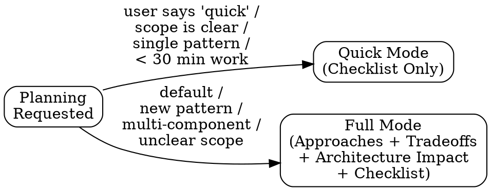
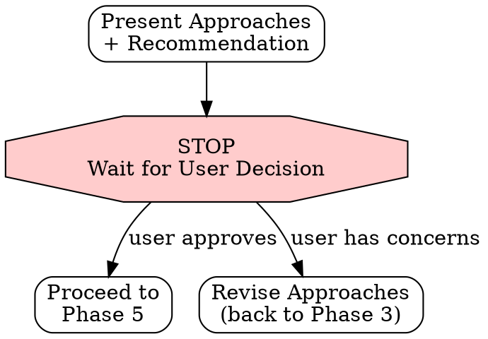

# Plan — Design Before Code

You are executing a BEHAVIORAL CONTRACT. Every phase is MANDATORY.
Code without a plan is just typing. Plans without approval are just daydreaming.

---

## Mode Selection



**Quick Mode** — Architecture check + checklist of atomic tasks. Use when scope is crystal clear, the pattern already exists, and work is under 30 minutes.
**Full Mode** — Multiple approaches with tradeoffs, architecture impact analysis, approval gate, then atomic checklist. This is the DEFAULT.

If the user says "just do it" — use Quick Mode, but still produce the checklist. There is no mode where you skip planning entirely.

---

## Phase 0: Declare the Phase (MANDATORY — both modes)

Set the RIPER phase and lead your response with the runtime banner:
```bash
bash .claude/hooks/scripts/riper-state.sh set PHASE PLAN
```
```
AID · PLAN — read-only. I am designing and getting approval, not coding.
No source edits this phase — approaches, decisions, and an atomic checklist only.
```
While a phase is set, lead each response with its `AID · <PHASE>` banner. If the
`.claude/hooks/scripts/riper-state.sh` helper is absent (older install), say so, recommend
`/aid-init`, and continue read-only. (The gate arms EXECUTE only on `status: approved` — Phase
4/6 handle that; setting PHASE=PLAN here just declares the mode.)

---

## Phase 1: Load Architecture (MANDATORY — both modes)

Read the project's .aid/ files:

1. Read `.aid/ARCHITECTURE.md` — understand system structure, boundaries, patterns
2. Read `.aid/CONVENTIONS.md` — understand rules that constrain the design
3. Read `.aid/PROJECT.md` — understand project goals and domain
4. Search `.aid/memory/` — check for prior decisions or investigations in this area

State what you learned that affects the plan:

```markdown
### Architecture Context
- **Relevant components:** [which parts of the system are involved]
- **Existing patterns:** [patterns already used for similar things]
- **Constraints from conventions:** [rules that limit design choices]
- **Prior decisions:** [relevant past decisions from memory]
```

If aid files don't exist, state that and work from codebase analysis. But recommend creating them.

---

## Phase 2: Understand the Requirement (MANDATORY — both modes)

Before proposing solutions, make sure you understand the problem:

1. **What** needs to happen — the observable outcome
2. **Who** is affected — users, other services, other developers
3. **Why** this matters — business value, technical necessity, user pain
4. **Constraints** — timeline, backward compatibility, performance, dependencies
5. **What does "done" look like** — acceptance criteria

```markdown
### Requirement Understanding
- **What:** [observable outcome]
- **Who:** [affected parties]
- **Why:** [motivation]
- **Constraints:** [limitations]
- **Done when:** [acceptance criteria]
```

If any of these are unclear, ASK. Do not assume. A plan built on assumptions is a plan that will change.

---

## Phase 3: Propose Approaches (Full Mode — MANDATORY)

Propose 2-3 approaches. Not 1. Not "here's what I'd do." MULTIPLE approaches with explicit tradeoffs.

For each approach:

```markdown
### Approach [N]: [Name]

**How it works:**
[Brief description of the approach]

**Files affected:**
- [file path] — [what changes]
- [file path] — [what changes]

**Tradeoffs:**
| Dimension | Assessment |
|-----------|-----------|
| Complexity | Low / Medium / High |
| Risk | Low / Medium / High — [why] |
| Testability | Easy / Moderate / Hard — [why] |
| Consistency with existing patterns | Matches / Extends / New pattern |
| Future flexibility | [assessment] |
| Time estimate | [minutes/hours] |

**Architecture impact:**
- [Does this change boundaries?]
- [Does this add new dependencies?]
- [Does this introduce a new pattern?]
- [Should ARCHITECTURE.md be updated?]
```

After presenting approaches, state your recommendation and why.

---

## Phase 4: Get Approval (Full Mode — MANDATORY)



**STOP AND WAIT FOR APPROVAL.**

Do NOT proceed to the checklist until the user has approved an approach. Present your recommendation, then ask:

> "Which approach do you want to go with? Or should I adjust any of these?"

The approval gate is not a formality. It is the point where the user's judgment meets your analysis. Skip it and you build the wrong thing.

**On approval — arm the EXECUTE gate (RIPER workflow):**

The moment the user approves an approach, this plan becomes the authority that
`/aid-execute` is allowed to implement — and the PreToolUse gate hook
(`riper-gate.sh`) will refuse source edits in EXECUTE until it sees an approved
plan. So when the user approves, after you save the plan (Phase 6) you MUST:

1. Stamp the saved plan's frontmatter `status: approved` (not `planned`).
2. Point the workflow at it:
   ```bash
   bash .claude/hooks/scripts/riper-state.sh set ACTIVE_PLAN memory/YYYY-MM-DD-[slug].md
   bash .claude/hooks/scripts/riper-state.sh set PHASE PLAN
   ```
   (Setting `ACTIVE_PLAN` + `status: approved` is exactly what unlocks `/aid-execute`.
   If the helper script is absent — older install — skip silently; the skill still works.)

Until the user approves, the plan stays `status: planned` and the gate stays shut.

### Phase 4.5: Jira Sync — awaiting approval (conditional — fail-open)

At the approval gate, before/alongside the STOP, follow `.claude/rules/aid-jira.md`. If `jira`
is disabled/absent or the Atlassian MCP is unavailable, skip silently — Jira NEVER blocks the gate.
- **Event:** `plan_awaiting_approval`
- **Default transition:** `Technical Specification Review` (comment-only if null)
- **Comment payload:** the requirement, the approaches considered, and your recommendation.

---

## Phase 5: Break Into Atomic Tasks (MANDATORY — both modes)

Convert the approved approach into a numbered checklist of atomic tasks.

Each task MUST be:
- **2-5 minutes of work** — if it's longer, break it down further
- **Complete code** — no "implement the logic" placeholders
- **Independently verifiable** — you can check if it's done
- **Ordered by dependency** — each task only depends on tasks above it

Format:

```markdown
### Implementation Checklist

- [ ] **1. [Action verb] [specific thing]**
  Files: `[path]`
  Details: [exactly what to do — specific enough that any developer could execute it]
  Verify: [how to confirm this task is done]

- [ ] **2. [Action verb] [specific thing]**
  Files: `[path]`
  Details: [exactly what to do]
  Verify: [how to confirm]

...
```

Bad task: "Implement the user service"
Good task: "Add getUserById method to src/services/user.ts that queries the users table by primary key and returns a UserDTO or null"

Bad task: "Add tests"
Good task: "Add test in src/services/__tests__/user.test.ts: getUserById returns UserDTO when user exists, returns null when user doesn't exist, throws on database error"

If a task description says "implement", "handle", "add logic for" without specifying WHAT — it is a placeholder and must be broken down further.

---

## Phase 6: Save Plan to Memory (MANDATORY — both modes)

**Every plan gets saved. No exceptions.**

Plans are decisions. Decisions without records are decisions that get re-litigated. When someone asks "why did we build it this way?" three months from now, the plan record is the answer.

Skip this phase ONLY if: Quick Mode AND the work is a trivial extension of an existing pattern with zero architectural decisions.

Save the plan to `.aid/memory/`:

**The `status:` line MUST have no trailing comment** — the gate matches `status: approved`
exactly (end-anchored). On approval (Phase 4) change the value `planned` → `approved` in
place, producing a bare `status: approved` line. (Do NOT append a `# comment` to that line —
it would break the gate's match and deadlock `/aid-execute` after a legitimate approval.)

```markdown
---
date: YYYY-MM-DD
verified: YYYY-MM-DD
type: plan
feature: [feature name]
approach: [chosen approach name]
status: planned
files: [list of files that will be affected]
confidence: high
related: [paths to related memory files, if any]
---

# Plan: [feature name]

## Requirement
[what needs to happen and why]

## Approach Chosen
[chosen approach summary]

## Alternatives Considered (Full Mode)
- [approach 2 — why rejected]
- [approach 3 — why rejected]

## Key Decisions
- [decision 1 and rationale]
- [decision 2 and rationale]

## Architecture Impact
- [boundaries affected, new patterns, dependency changes]
- [whether ARCHITECTURE.md needs updating after implementation]

## Testing Strategy
- **Unit:** [what gets unit tests — new logic, edge cases, error paths]
- **Integration:** [what gets integration coverage — boundaries this change crosses]
- **Manual:** [what a human must verify that automation cannot]
- **Regression risk:** [existing tests that must still pass; any that will need updating]

## Rollback Plan
- **How to undo:** [revert commit / feature flag off / migration down / redeploy previous]
- **Data safety:** [is any change destructive or one-way? migrations, deletes, schema drops]
- **Blast radius if it fails in prod:** [who/what is affected while rolling back]
- **Point of no return:** [the step after which rollback stops being clean — or "none"]

## Risk Assessment
| Risk | Probability | Impact | Mitigation |
|---|---|---|---|
| [what could go wrong] | Low/Med/High | Low/Med/High | [how it is handled or detected] |

## Success Criteria
- [ ] [measurable outcome 1 — how we know it worked]
- [ ] [measurable outcome 2]
- [ ] All tests passing
- [ ] No breaking changes (or a documented migration path)

## Checklist
[the implementation checklist]
```

> **Why these four sections are mandatory.** A plan without a testing strategy defers the
> hardest thinking to EXECUTE, where the gate is already open. A plan without a rollback
> plan is a one-way door taken blind. Unstructured risk ("this is risky") is unactionable —
> probability × impact × mitigation is. And success criteria are what REVIEW audits against;
> without them "done" is an opinion. Adopted from the Eptura Copilot RIPER plan template.

**Cross-link related memories:**
Check `.aid/memory/` for existing memories about the same files or feature. If found, add their paths to `related:` and update the existing memories to link back.

**Then update the compiled index:**
- Add a one-line entry to `.aid/MEMORY.md` under "Plans":
  ```
  - **Plan: [feature] ([date])** — Approach: [name], [key decision]. → memory/YYYY-MM-DD-[slug].md
  ```

After saving, state:
```
Plan saved:
  Source: .aid/memory/YYYY-MM-DD-[slug].md
  Compiled: MEMORY.md updated
```

This creates a record of WHY this approach was chosen, not just what was built. When the next engineer (or AI) touches this area, they won't re-derive the same tradeoffs — they'll read the plan and understand instantly.

**Quick Mode arming (MANDATORY when the work will proceed to /aid-execute):** Quick Mode
skips the Phase 4 approach-selection gate, but it must NOT skip arming — otherwise the
plan sits at `status: planned` and `/aid-execute` (correctly) refuses to start: a dead end.
The user's go-ahead on the checklist ("go", "do it", "looks good") IS the approval. On that
go-ahead:
1. Stamp the saved plan's frontmatter `status: approved` (bare line, no trailing comment).
2. Arm the workflow cursor exactly as Full Mode does:
   ```bash
   bash .claude/hooks/scripts/riper-state.sh set ACTIVE_PLAN memory/YYYY-MM-DD-[slug].md
   bash .claude/hooks/scripts/riper-state.sh set PHASE PLAN
   ```
The ONLY unarmed path is the trivial-extension case where Phase 6 itself was legitimately
skipped — and then the work must not claim to be a gated RIPER cycle at all.

### Phase 6.5: Jira Sync — plan approved (conditional — fail-open)

**Only once the plan is actually stamped `status: approved`.** Follow `.claude/rules/aid-jira.md`.
Skip silently if `jira` is disabled/absent or the MCP is unavailable — Jira NEVER blocks the handoff.
- **Event:** `plan_approved`
- **Default transition:** `Plan Approval` (→ Code Creation; comment-only if null)
- **Comment payload:** the chosen approach, checklist item count, plan path, and files list.

---

## Rationalization Table

These are excuses you will want to make. They are all wrong.

| Excuse | Why It's Wrong |
|--------|---------------|
| "Jira is down, skip the sync AND the plan save" | Wrong — memory is authoritative. Save the plan, log the skip, continue. |
| "It's obvious, no need to plan" | If it were obvious, it wouldn't need building. The plan exposes hidden complexity. Plan always. |
| "There's only one way to do this" | There are always tradeoffs. Even "the obvious way" has alternatives worth considering for 30 seconds. |
| "The user said 'just do it'" | Quick Mode exists for this. A checklist still gets produced. "Just do it" means "don't overthink it", not "don't think at all." |
| "I'll figure it out as I go" | That's called hacking, not engineering. You'll change direction 3 times and leave dead code behind. |
| "Planning takes too long" | A 5-minute plan saves 30 minutes of backtracking. A 15-minute plan saves days of rework. This is not debatable. |
| "The codebase has no architecture docs" | Analyze the codebase, state what you observe, and plan against that. Then recommend creating ARCHITECTURE.md. |
| "The tasks are too granular" | 2-5 minute tasks are the right size. If they feel too granular, you're not used to thinking at this level of precision. That's the point. |
| "I don't need approval for this" | Yes you do. Even in Quick Mode, the checklist is visible for review. In Full Mode, the approval gate is mandatory. |
| "This plan isn't worth saving" | WRONG. Plans capture decisions. Unsaved decisions get re-litigated. Every "why did we do it this way?" that goes unanswered is a plan that wasn't saved. |

---

## Contract

By executing this skill, you agree:

1. You will read architecture context before designing
2. You will understand the requirement before proposing solutions
3. You will propose multiple approaches with explicit tradeoffs (Full Mode)
4. You will STOP and wait for approval before producing the checklist (Full Mode)
5. You will break work into 2-5 minute atomic tasks with no placeholders
6. You will never start coding without at least a checklist
7. You will save the plan to memory — every time
8. You will sync gates to Jira when configured — and never let Jira block the work
