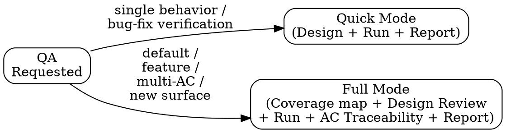
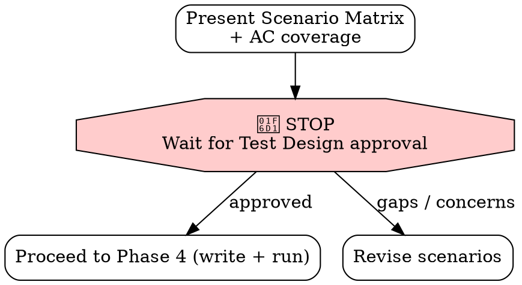

# QA — Test Design, Execution, and Report (RIPER QA Discipline)

You are executing a BEHAVIORAL CONTRACT. Every phase is MANDATORY.
QA is not "did I write a test." QA is: design the right tests against the acceptance
criteria, get the test design reviewed, run them, and report a defensible PASS/FAIL.

This is the QA half of RIPER. The dev flow (research → plan → execute → review) builds
the change; this flow proves it does what it was supposed to. It mirrors the dev gates:
a **Test Design Review** approval gate (like PLAN's), and a hard **green-or-fail** result
(like ship's test gate). Test code is just code — it goes through the same wall.

**NO QA PASS WITHOUT A TEST RUN THAT ACTUALLY EXECUTED GREEN.**

---

## Mode Selection



**Quick Mode** — Design the scenarios, run them, report. For verifying one behavior or a bug fix.
**Full Mode** — Coverage analysis, approval-gated Test Design Review, execution, acceptance-criteria traceability, structured QA Report. This is the DEFAULT.

---

## Phase 1: Load Requirements & Coverage (MANDATORY — both modes)

You cannot test against requirements you haven't named.

1. Identify the **acceptance criteria (AC)**: from the Jira ticket, the approved plan in
   `.aid/memory/` (if this followed a dev RIPER loop), or by asking the user. List them explicitly.
2. Read `.aid/COVERAGE.md` (if present) — what's already tested, what's a known gap, which
   modules are HIGH risk.
3. Search `.aid/memory/` for the plan/execution/review records for this change, and any
   prior investigations of the same area (past incidents are test cases waiting to be written).
4. Identify the **test command + framework** from `.aid/CONVENTIONS.md` / package.json /
   Makefile / the spec dir.

State what you loaded:

```markdown
### QA Context
- **Acceptance Criteria:** [enumerated AC1, AC2, ...]
- **Change under test:** [files / behavior]
- **Existing coverage:** [from COVERAGE.md, or "unknown"]
- **Test command:** [exact command]
- **Related memory:** [plan/execution/investigation paths]
```

If the change has **no formal acceptance criteria by design** (a refactor, dependency
bump, or internal cleanup), do NOT invent them — state the **implicit AC: behavioral
equivalence**. The test goal is "existing tests stay green + a characterization/regression
test pins the behavior that must not change." Proceed with that as AC1.

If the change *should* have acceptance criteria but you can't find them, STOP and ask. QA
against guessed requirements is theater.

---

## Phase 2: Design the Test Scenarios (MANDATORY — both modes)

Build a **scenario matrix** that maps every acceptance criterion to concrete test cases.
Cover the unhappy paths, not just the happy one — that is where defects hide.

```markdown
### Test Scenario Matrix

| # | Acceptance Criterion | Scenario | Type | Expected |
|---|---------------------|----------|------|----------|
| 1 | AC1 — [criterion] | [the case being exercised] | happy / edge / negative / regression | [expected outcome] |
| 2 | AC1 | [boundary case] | edge | [expected] |
| 3 | AC2 — [criterion] | [failure case] | negative | [rejected with X] |
| ... | ... | ... | ... | ... |
```

Required coverage dimensions (omit one only with an explicit reason):
- **Happy path** — the intended behavior works.
- **Edge / boundary** — empty, null, zero, max, duplicate, concurrent.
- **Negative** — invalid input is rejected the way the AC says.
- **Regression** — any past incident in `.aid/memory/` for this area is a scenario.
- **Non-functional** (when an AC specifies it) — performance (`p95 < 200ms`), security
  (`rejects unauthenticated requests`), or concurrency gets its own scenario with a
  measurable assertion. Do not hand-wave a non-functional AC into PASS.
- **Manual / exploratory** (only when automation can't economically cover it — UI/visual)
  — a valid scenario *type*, but it requires RECORDED evidence (what was checked, by whom,
  result), never an unverified "looks fine."
- **Traceability** — EVERY acceptance criterion appears in at least one row. An AC with no
  scenario is an untested requirement — call it out.

State coverage of the AC explicitly: "AC1: rows 1-2 · AC2: row 3 · **AC3: NO SCENARIO — gap**".

---

## Phase 3: Test Design Review — Approval Gate (Full Mode — MANDATORY)



**STOP AND WAIT FOR APPROVAL of the test design before writing or running tests.**

This is the QA equivalent of PLAN's approval gate — the engineer confirms the scenarios
actually cover the requirement and the edge cases that matter, BEFORE effort goes into
automation. Present the matrix and ask:

> "Does this scenario matrix cover the acceptance criteria and the edge cases you care about? Approve to proceed, or tell me what's missing."

This is a **behavioral STOP**, not a mechanical wall. Do NOT set a RIPER phase here: QA's
next step (Phase 4) WRITES test code, which the read-only phases (RESEARCH/INNOVATE/PLAN/
REVIEW) would block — borrowing PLAN's wall would deadlock this skill's own happy path.
Just stop and wait for the user's approval before writing/running tests.

If a dev RIPER loop is already in flight (a PHASE/ACTIVE_PLAN is set), leave it untouched —
QA does not own that state and must not clear it. (Quick Mode may skip the explicit gate,
but still presents the matrix before running.)

### Phase 3.5: Jira Sync — QA design ready (conditional — fail-open)

After the Test Design Review gate, follow `.claude/rules/aid-jira.md`. Skip silently if `jira`
is disabled/absent or the MCP is unavailable — Jira NEVER blocks QA.
- **Event:** `qa_design_ready`
- **Default transition:** *comment-only by default* — the parallel QA-track statuses don't fit
  one ticket; orgs may map it to e.g. "QA: Functional Test Case Review" via `statusMap`.
- **Comment payload:** the scenario-matrix digest, coverage, and gaps.

---

## Phase 4: Write & Run the Tests — behavioral HARD GATE (MANDATORY — both modes)

Implement the approved scenarios as real test code, then RUN them. **Authoring is Phase 4's
first half; running them green is the gate.** Writing a test ≠ QA.

This is a *behavioral* gate enforced by this contract (no hook runs your tests for you) —
but it is no less binding for that: the verdict logic below makes un-run/failing tests
impossible to honestly call PASS.

1. Write the test cases per the matrix, in the project's framework and conventions. Each
   test must be **isolated** — it sets up and tears down its own state, does not depend on
   run order, and uses fixtures/mocks for external dependencies (an integration test with a
   real dependency is a deliberate, labeled exception).
2. Run the relevant suite (the new tests + the existing tests for the touched area — a fix
   that breaks a neighboring test is a FAIL).
3. **Stability check** — for any non-trivial suite, run the new/affected tests at least
   **twice** (or note the CI re-run). A test that is green-then-red is **FLAKY**, which is a
   FAIL — fix the test's determinism, never paper over it with `sleep`/retry. "It passed the
   second time" is not a pass.
4. **Evaluate the gate** (identical posture to `aid-ship` Phase 2):
   - **Could not run** (no toolchain / no DB / env limit) → 🛑 the QA result is **BLOCKED**,
     not PASS. State: *"Tests authored but NOT executed here ([reason]). QA verdict is BLOCKED
     until they run green in CI / a real env."* Do NOT report PASS.
   - **Any fail (incl. flaky)** → that is the QA finding. Report which AC failed; do not "fix and hide."
   - **All green, stable across re-run** → record the evidence.
5. Record:

```markdown
### Test Execution
- **Command:** [exact command]
- **Ran:** [YES — executed here / NO — could not run, reason]
- **Result:** [X passed, Y failed, Z skipped]
- **Failures → AC:** [which acceptance criterion each failure maps to, or "none"]
```

A QA verdict of PASS requires `Ran: YES` and zero failures. Anything else is FAIL or BLOCKED.

---

## Phase 5: Produce the QA Report (MANDATORY — both modes)

The deliverable is a defensible verdict with full acceptance-criteria traceability — the
artifact a human QA reviewer signs off on (AIDLC deck: "QA Report — PASS/FAIL with full AC
traceability").

```markdown
## QA Report

**Target:** [change / ticket under test]
**Mode:** Quick / Full
**Verdict:** ✅ PASS / ❌ FAIL / ⛔ BLOCKED (tests not executed)

### Acceptance Criteria Traceability
| AC | Covered by | Status |
|----|-----------|--------|
| AC1 — [criterion] | scenarios 1,2 | ✅ pass |
| AC2 — [criterion] | scenario 3 | ❌ fail — [what broke] |
| AC3 — [criterion] | — | ⛔ NO TEST (gap) |

### Test Execution
[from Phase 4 — command, ran?, results]

### Coverage Notes
[gaps vs COVERAGE.md; ACs with no scenario; regression cases from past incidents]

### Findings
[Each failure or gap, with file:line and the AC it violates. "Clean" if none.]

### Recommendation
[Ship / Do not ship — block on AC2 / Add tests for AC3 first]
```

**Verdict rule (state it once, apply it always):** any AC without passing evidence means the
overall verdict CANNOT be PASS.
- Suite ran green but an AC has **no test** → **FAIL** (missing coverage), not BLOCKED.
- Suite **could not execute at all** (no toolchain/DB/env) → **BLOCKED**.
- A verdict of PASS with any AC marked "NO TEST" is a contradiction — it is a FAIL.

The QA Report is a verdict on **tests-vs-AC**, not a ship decision — `aid-ship` owns that.
Phrase the recommendation as "ready for ship / blocks ship on ACn", not "ship it."

---

## Phase 6: Save QA Record to Memory (MANDATORY — both modes)

**Every QA pass gets recorded.** The QA history is what tells a future engineer "this was
verified against these criteria, this way, on this date."

Save to `.aid/memory/`:

```markdown
---
date: YYYY-MM-DD
verified: YYYY-MM-DD
type: qa
target: [change / ticket]
verdict: PASS / FAIL / BLOCKED
acceptance_criteria: [count covered / total]
tests_authored: [paths of test files THIS QA run created/modified — REQUIRED even if empty]
confidence: high
related: [plan / execution / review memory paths]
jira: [ticket]
---

# QA: [one-line description]

## Verdict
[PASS / FAIL / BLOCKED + one-line why]

## AC Traceability
- [AC → scenario → status]

## Test Execution
- [command, ran?, result]

## Gaps / Follow-ups
- [untested ACs, coverage gaps, flaky tests]
```

**Cross-link:** add this QA record to the related plan/execution/review records' `related:`
lists — **this is what lets /aid-review and /aid-ship mechanically distinguish QA-authored
test files from plan deviations** (they read `tests_authored:` via the plan's `related:`) — and add a one-line entry to `.aid/MEMORY.md` under "QA":
```
- **QA: [description] ([date])** — [verdict], [N/M ACs covered]. → memory/YYYY-MM-DD-[slug].md
```

(QA sets no RIPER phase, so there is nothing to clear here — and never run
`riper-state.sh clear`: it would wipe an in-flight dev loop's PHASE + ACTIVE_PLAN.)

### Phase 6.5: Jira Sync — QA verdict (conditional — fail-open)

**Only after the QA record is saved.** Follow `.claude/rules/aid-jira.md`; skip silently if
`jira` is disabled/absent or the MCP is unavailable — Jira NEVER blocks the QA report. Also
write the resolved ticket key into this record's `jira:` frontmatter field.
- **Event:** `qa_passed` / `qa_failed` / `qa_blocked` (from the Phase 5 verdict)
- **Default transition:** `qa_passed` → `Testing successfully completed`; `qa_failed` and
  `qa_blocked` → *comment-only* (never transition on a failed/blocked run).
- **Comment payload:** the verdict, AC traceability M/N, and the exact test command + result.

---

## Rationalization Table

These are excuses you will want to make. They are all wrong.

| Excuse | Why It's Wrong |
|--------|---------------|
| "Jira is down, skip the sync AND the QA record" | Wrong — memory is authoritative. Save the QA record, log the Jira skip, continue. Only qa_passed transitions; failed/blocked are comment-only. |
| "The code looks right, I'll mark it PASS" | QA verifies behavior against acceptance criteria, by running tests — not by reading code. No green run, no PASS. |
| "I wrote the tests, that's QA done" | Writing tests is the first half of Phase 4. Running them green is the gate. An un-run test is an open gate, not a pass. |
| "It passed the second time" | Flaky is not green. A test that's green-then-red is a FAIL until its determinism is fixed — never masked with sleeps or retries. |
| "The recommendation says ship, so ship" | The QA Report verdicts tests-vs-AC. The ship decision is aid-ship's, after its own gates (full suite, Endor, verification). QA says 'ready' or 'blocks on ACn' — not 'shipped'. |
| "Tests couldn't run here, but they'd pass — PASS" | BLOCKED, not PASS. You do not know they pass until they run. Hand off to CI; report BLOCKED honestly. |
| "Just the happy path is enough" | Defects live in edges and negatives. A happy-path-only matrix is not a test design — it's a demo. |
| "Every AC doesn't need its own test" | Every AC needs at least one scenario, or it's an untested requirement. Name the gap; don't bury it. |
| "Skip the design review, I'll just write tests" | The Test Design Review catches missing coverage before automation effort is spent. It's the QA approval gate — Full Mode does not skip it. |
| "A failing test means the test is wrong" | Sometimes. Usually it means the code is wrong. Investigate before 'fixing' the test — a test edited to pass is how bugs ship. |
| "No need to save the QA record" | WRONG. When the feature regresses in 3 weeks, the QA record is what was verified, how, against which ACs. Save it. |

---

## Contract

By executing this skill, you agree:

1. You will identify the acceptance criteria before designing any test
2. You will build a scenario matrix covering happy, edge, negative, and regression cases, with every AC traced
3. You will get the test design approved before writing/running (Full Mode) — the QA approval gate
4. You will treat un-run or failing tests as FAIL/BLOCKED — never PASS — exactly like the ship test gate
5. You will produce a QA Report with full acceptance-criteria traceability and an honest verdict
6. You will save the QA record to memory — every time
7. You will sync gates to Jira when configured — and never let Jira block the work
