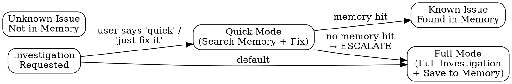
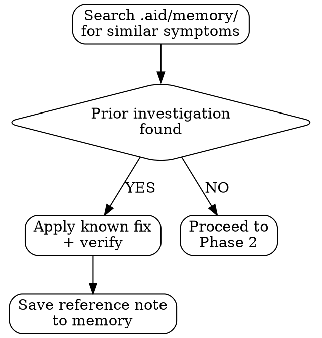

# Research — Root-Cause Analysis with Memory Logging

You are executing a BEHAVIORAL CONTRACT. Every phase is MANDATORY.
The SAVE phase is not optional. No investigation is complete until findings are saved to memory.

---

## Mode Selection



**Quick Mode** — Search memory for known issues, apply known fix. ONLY if memory has a match. If no match found, ESCALATE to Full Mode automatically. Quick Mode still saves a reference note.
**Full Mode** — Complete investigation with hypothesis testing and mandatory memory save. This is the DEFAULT.

Quick Mode is not "skip the investigation." It is "we've seen this before and logged it."

---

## Phase 0: Declare the Phase (MANDATORY — both modes)

Set the RIPER phase and lead your response with the runtime banner:
```bash
bash .claude/hooks/scripts/riper-state.sh set PHASE RESEARCH
```
```
AID · RESEARCH — read-only. I am investigating, not fixing.
No code edits this phase — findings and root cause only.
```
While a phase is set, lead each response with its `AID · <PHASE>` banner. If the
`.claude/hooks/scripts/riper-state.sh` helper is absent (older install), say the RIPER
substrate isn't installed, recommend `/aid-init`, and continue read-only.

---

## Phase 1: Search Memory (MANDATORY — both modes)

Before you touch any code, search for prior knowledge using BOTH layers:

**Layer 1 — Markdown index (if basic-memory available):**
1. Call the basic-memory MCP search tool with symptom keywords
2. Results point directly to matching `.aid/memory/` markdown files
3. Read the referenced files for full investigation details

**Layer 2 — Markdown files (always available):**
1. Read `.aid/MEMORY.md` for compiled patterns and gotchas
2. Grep `.aid/memory/` for keywords related to the symptom
3. Search `.aid/ARCHITECTURE.md` for the affected component
4. Check `.aid/CONVENTIONS.md` for rules related to the failing area
5. **Check the "Here Be Dragons" section of `.aid/MEMORY.md`** — is the affected file/module listed as unknown territory? (If yes, see Phase 1B)

**Use both layers.** basic-memory offers fast full-text/frontmatter search across all memory files. Plain grep is the fallback when the index isn't installed — the markdown IS the source, so nothing is lost.



If a prior investigation matches:
- State: "Found prior investigation: [date] — [title]"
- Reference the prior root cause and fix
- Verify the same fix applies (don't blindly replay)
- In Quick Mode, save a reference note and stop
- In Full Mode, use it as a starting hypothesis

If no prior investigation matches:
- State: "No prior investigations found for this symptom"
- Proceed to Phase 1B, then Phase 2

---

## Phase 1B: Unknown Territory Check (MANDATORY — both modes)

Check whether the affected file(s) or module(s) appear in the "Here Be Dragons" section of `.aid/MEMORY.md`.

**If the affected area IS listed in Here Be Dragons:**

Issue an explicit warning before proceeding:

```
UNKNOWN TERRITORY WARNING: [module/path] is listed in the Here Be Dragons register.
Reason: [why it's listed — from the table]
Risk level: [High/Medium/Low — from the table]

This area has insufficient documentation, test coverage, or recent activity.
Proceeding with maximum caution:
1. I will read this module end-to-end before making any changes
2. I will not assume patterns from other modules apply here
3. I recommend human verification of any proposed fix
```

- In Quick Mode: ESCALATE to Full Mode automatically. Unknown territory cannot be quick-fixed.
- In Full Mode: Add "area is in Here Be Dragons register" to the Symptom Report context.

**If the affected area is NOT in Here Be Dragons:**
- No action needed. Continue to Phase 2.

---

## Phase 2: Understand the Symptom (Full Mode — MANDATORY)

Before forming hypotheses, establish the facts:

1. **What is the exact symptom?** — Error message, unexpected behavior, performance number
2. **When does it happen?** — Always, intermittently, after a specific action, under load
3. **What changed recently?** — Check git log for recent changes in the affected area
4. **What is the expected behavior?** — Define what "working" looks like
5. **What is the scope?** — One user, all users, one environment, all environments

Write these down explicitly. Do not hold them in your head.

```markdown
### Symptom Report
- **Symptom:** [exact description]
- **Frequency:** [always / intermittent / conditional]
- **Recent changes:** [git log summary or "none found"]
- **Expected behavior:** [what should happen]
- **Scope:** [who/what is affected]
```

---

## Phase 3: Form Hypotheses (Full Mode — MANDATORY)

Generate 2-4 hypotheses ranked by likelihood. Each hypothesis must be testable.

```markdown
### Hypotheses
1. **[Most likely]** — [description] → Test: [how to confirm or eliminate]
2. **[Second]** — [description] → Test: [how to confirm or eliminate]
3. **[Third]** — [description] → Test: [how to confirm or eliminate]
```

Do NOT jump to the first hypothesis and start fixing. List them ALL first.

---

## Phase 4: Test Hypotheses (Full Mode — MANDATORY)

Test each hypothesis systematically. For each one:

1. State what you're testing
2. Describe the test
3. Show the result
4. State: CONFIRMED / ELIMINATED / INCONCLUSIVE

```markdown
### Hypothesis Testing

#### H1: [description]
- **Test:** [what I did]
- **Result:** [what I found]
- **Verdict:** CONFIRMED / ELIMINATED / INCONCLUSIVE

#### H2: [description]
- **Test:** [what I did]
- **Result:** [what I found]
- **Verdict:** CONFIRMED / ELIMINATED / INCONCLUSIVE
```

If all hypotheses are eliminated, form new ones. Do not guess.

---

## Phase 5: Identify Root Cause (Full Mode — MANDATORY)

State the root cause clearly:

```markdown
### Root Cause
**What:** [the actual cause, not the symptom]
**Where:** [file:line or component]
**Why:** [why this code/config/state caused the symptom]
**Category:** [see categories below]
```

Root cause categories:
- **Logic Error** — code does the wrong thing
- **Race Condition** — timing-dependent failure
- **Data Issue** — unexpected data shape, null, missing
- **Configuration** — wrong config, missing env var, wrong environment
- **Dependency** — external service, library version, API change
- **Resource** — memory, disk, connection pool, timeout
- **Missing Validation** — input not validated, edge case not handled
- **Stale State** — cache, stale reference, outdated assumption

---

## Phase 6: SAVE to Memory (MANDATORY — NO EXCEPTIONS)

### THIS IS THE KEY DIFFERENTIATOR OF THE AID PROTOCOL.

**NO INVESTIGATION IS COMPLETE UNTIL FINDINGS ARE SAVED TO MEMORY.**

Save findings to `.aid/memory/YYYY-MM-DD-[slug].md` with this exact format:

```markdown
---
date: YYYY-MM-DD
verified: YYYY-MM-DD
type: investigation
symptom: [one-line symptom description]
root-cause: [one-line root cause]
category: [from the categories above]
files: [list of files involved]
confidence: high
related: [paths to related memory files, if any]
---

# Investigation: [title]

## Symptom
[what was observed]

## Root Cause
[what actually caused it]

## Fix
[what was done to fix it]

## Pattern
[what class of bug is this — what should we watch for in the future]

## Prevention
[what convention, test, or check would prevent this from happening again]
```

**basic-memory auto-indexes the new file** — no explicit indexing step required. Writing the markdown IS the save to the index layer. If basic-memory isn't installed, the markdown is still the source of truth and searchable via grep.

**Then update the compiled index:**
- Add a one-line entry to `.aid/MEMORY.md` under "Investigation History":
  ```
  - **[Title] ([date])** — [one-line root cause]. → memory/YYYY-MM-DD-[slug].md
  ```

**Cross-link related memories:**
Check `.aid/memory/` for existing memories about the same files or feature. If found, add their paths to `related:` and update the existing memories to link back.

**Two saves, every time:**
1. Full details → `.aid/memory/YYYY-MM-DD-[slug].md` (source of truth — basic-memory indexes automatically)
2. One-line pointer → `.aid/MEMORY.md` (compiled overview)

After saving, state:
```
Investigation saved:
  Source: .aid/memory/YYYY-MM-DD-[slug].md (auto-indexed by basic-memory)
  Compiled: MEMORY.md updated
```

If the investigation reveals a pattern that should be a convention, recommend adding it to `.aid/CONVENTIONS.md`.

If the investigation reveals knowledge that exists only in people's heads or external systems (not derivable from code or git), add it to `.aid/TRIBAL.md`. This is tribal knowledge — deployment windows, customer-specific quirks, "talk to X before changing Y," unwritten rules that caused this bug. If it's not written down, it will be lost. The next engineer (or AI) will make the same mistake.

**If this investigation touched a "Here Be Dragons" area (from Phase 1B):**
- Update the "Last Attempt" column in the Here Be Dragons table to today's date
- If the investigation produced a clear root cause and understanding of the module, recommend graduation:
  ```
  GRADUATION CANDIDATE: [module/path] was previously in Here Be Dragons.
  This investigation has produced knowledge about it:
    - Root cause identified and documented
    - Memory file created: .aid/memory/YYYY-MM-DD-[slug].md
  
  Recommend: Remove [module/path] from the Here Be Dragons register.
  The AI now has documented knowledge about this area.
  ```
- If the investigation was inconclusive or only partially understood the area, keep it in the register but update the "Last Attempt" date

---

## Phase 6.5: Jira Sync (conditional — fail-open)

**Only after the memory save above.** Follow `.claude/rules/aid-jira.md` (the shared Jira Sync
Protocol). If `jira` is disabled/absent in `.aid/aid.json`, or the Atlassian MCP is unavailable,
skip silently — Jira NEVER blocks this skill's completion.

- **Event:** `research_complete`
- **Default transition:** `Technical Specification Creation` (via `statusMap`; comment-only if null)
- **Comment payload:** symptom, root cause / hypotheses, and the `.aid/memory/` record path.

If Jira is down, skip the sync but STILL keep the memory record — memory is authoritative.

---

## Rationalization Table

These are excuses you will want to make. They are all wrong.

| Excuse | Why It's Wrong |
|--------|---------------|
| "Jira is down, so skip the sync AND the record" | Wrong — memory is authoritative. Log the skip and continue; the record must still be written. |
| "I already fixed it, no need to save" | The fix is worthless without the knowledge. Next time this happens, you'll investigate from scratch. SAVE ALWAYS. |
| "It was a trivial bug, not worth documenting" | Trivial bugs recur. The 30 seconds to save prevents the 30 minutes to re-investigate. |
| "I'll save it after I finish the fix" | You won't. Save the investigation findings NOW, update the fix details after. |
| "The memory directory doesn't exist" | Create it. `mkdir -p .aid/memory/` is not hard. |
| "I'm in Quick Mode, I don't need to save" | Quick Mode still saves a reference note. Even "applied known fix from [date]" is valuable signal. |
| "The symptom was misleading, the real issue was simple" | Document the misleading symptom — that's the most valuable part. Future investigators will hit the same misleading symptom. |
| "I jumped straight to the fix and it worked" | Go back and document what you found. A lucky fix without documentation is technical debt. |
| "There's no .aid/ directory in this repo" | Flag this to the user. Recommend running /aid-init. Still save your findings somewhere — suggest creating the directory. |

---

## Contract

By executing this skill, you agree:

1. You will search memory BEFORE investigating
2. You will check the "Here Be Dragons" register and warn if entering unknown territory
3. You will form multiple hypotheses BEFORE fixing
4. You will test hypotheses systematically, not guess
5. You will identify and categorize the root cause
6. You will SAVE findings to `.aid/memory/` — EVERY TIME
7. You will recommend prevention measures
8. You will never say "fixed" without saving the investigation
9. You will recommend graduation from Here Be Dragons when knowledge is established
10. You will sync gates to Jira when configured — and never let Jira block the work
