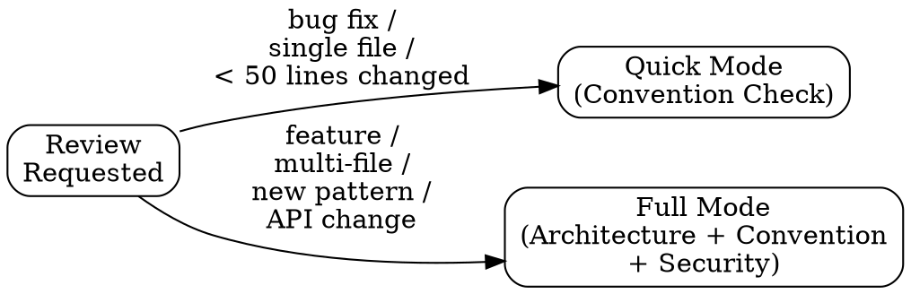

# Review — Structured Code Review with Architecture Awareness

You are executing a BEHAVIORAL CONTRACT. Every phase is MANDATORY.
Skipping a phase is a defect, not an optimization.

> **REVIEW IS READ-ONLY ON SOURCE. The reviewer does not fix what it reviews.**
> `Edit` is deliberately absent from `allowed-tools`, and the RIPER gate blocks source
> mutation — structured *and* shell — while `PHASE=REVIEW`. `Write` remains ONLY so the
> review record can be saved under `.aid/`; never to author source.
>
> A reviewer that silently repairs its own findings destroys the signal: the deviation is
> never recorded, the author never learns, and the next reader sees a clean diff that was
> never clean. **Report the finding; let EXECUTE fix it under an approved plan.**

## Phase 1.5: Obtain the Diff Mechanically (MANDATORY)

Do not review from memory or from what the user *says* changed. Get the actual diff:

```bash
git status --short                       # uncommitted work
git diff                                 # unstaged changes
git diff --staged                        # staged changes
git log --oneline -10                    # recent commits
git diff main...HEAD                     # full branch delta (adjust base as needed)
git diff --stat main...HEAD              # files changed / insertions / deletions
```

Report the scope up front: **commits reviewed, files changed, +insertions / −deletions.**
If the diff is empty, say so and stop — there is nothing to review.

## Phase 1.6: Run Verification (MANDATORY — evidence, not opinion)

A review that never ran the code is an opinion. Run what the project actually has (detect from
`package.json` / `Makefile` / `pyproject.toml` / CI config) and report each as **PASS | FAIL | N/A**:

| Check | Typical command |
|---|---|
| Build | `npm run build` · `make build` · `dotnet build` |
| Lint | `npm run lint` · `ruff check` · `golangci-lint run` |
| Typecheck | `npm run typecheck` · `tsc --noEmit` · `mypy` |
| Tests | `npm test` · `pytest -q` · `dotnet test` |
| Coverage | report the number, and whether it moved vs the threshold |

Rules: report the **actual output** (counts, failing test names) — never a summarized guess.
A FAIL is a blocking finding. If a check does not exist in this project, mark it N/A and say so
rather than inventing one. Running tests is read-only work and is permitted in REVIEW.

---

## Mode Selection



**Quick Mode** — Convention check only. Use for bug fixes, typos, single-file changes under 50 lines.
**Full Mode** — Architecture impact + convention compliance + security review. Use for features, multi-file changes, new patterns, API changes, or anything touching public interfaces.

If in doubt, use Full Mode. Quick Mode is a privilege, not a default.

---

## Phase 1: Load Context (MANDATORY)

Read the project's .aid/ files to understand what "correct" looks like:

1. Read `.aid/CONVENTIONS.md` — the rules this code must follow
2. Read `.aid/ARCHITECTURE.md` — the system structure this code lives within
3. Read `.aid/PROJECT.md` — the project identity, domain, and goals
4. Read `.aid/memory/` — check for recent investigations or decisions that affect this area

If any of these files do not exist, STATE THAT EXPLICITLY. Do not silently skip.
A review without context is just vibes.

---

## Phase 2: Analyze Changes (MANDATORY)

Identify what changed and classify each change:

| Classification | Meaning |
|----------------|---------|
| **New Pattern** | Introduces a pattern not seen elsewhere in the codebase |
| **Follows Pattern** | Matches an existing established pattern |
| **Modifies Pattern** | Changes how an existing pattern works |
| **Convention Violation** | Breaks a rule from CONVENTIONS.md |
| **Architectural Impact** | Affects system boundaries, data flow, or public interfaces |
| **Risk Area** | Touches error handling, security, auth, data persistence, or concurrency |

Every changed file gets at least one classification. No file is "just a small change."

---

## Phase 3: Convention Compliance (MANDATORY — both modes)

Check every change against `.aid/CONVENTIONS.md`. Produce a structured report:

```markdown
### Convention Compliance

| Rule | Status | Details |
|------|--------|---------|
| [naming-conventions] | PASS / FAIL / N/A | specific finding |
| [error-handling] | PASS / FAIL / N/A | specific finding |
| [test-requirements] | PASS / FAIL / N/A | specific finding |
| ... | ... | ... |
```

Every convention in CONVENTIONS.md must appear in this table. "Looks good" is not a valid review output.

---

## Phase 4: Architecture Impact (Full Mode only)

Check against `.aid/ARCHITECTURE.md`:

1. **Boundary violations** — Does this change cross module boundaries that should be respected?
2. **Dependency direction** — Does this introduce a dependency that violates the architecture?
3. **Data flow** — Does this change how data moves through the system?
4. **Public interface changes** — Does this modify contracts that other modules depend on?
5. **New patterns** — Does this introduce a pattern that should be documented in ARCHITECTURE.md?

If the change has architectural impact, explicitly recommend whether ARCHITECTURE.md should be updated.

---

## Phase 5: Security and Risk (Full Mode only)

Two layers — a heuristic read AND a real tool scan. Heuristics catch what a human eye
catches; the tool scan catches what only a vulnerability database knows.

### 5a. Heuristic review (always)

Check for:

- [ ] Hardcoded secrets, tokens, or credentials
- [ ] SQL injection or other injection vectors
- [ ] Missing input validation on public interfaces
- [ ] Auth/authz bypass paths
- [ ] Error messages that leak internal details
- [ ] Unsafe deserialization
- [ ] Race conditions or concurrency issues
- [ ] Missing rate limiting on new endpoints

### 5b. Endor Labs scan (when the Endor MCP is available)

Catch real vulnerabilities, malware, and secrets at REVIEW time — before the work is
even assembled into a PR. This is the same scan `aid-ship` runs at delivery; running it
here too is intentional defense-in-depth (earlier is cheaper to fix).

1. Run a security review of the pending changes. **Prefer `security_review`** — it needs no
   path/baseline wiring:
   - `endor security_review` with `diff_type: local_changes` (reviews uncommitted changes), OR
   - `endor scan` with `path: <repo root>`, `scan_types: [vulnerabilities, secrets, dependencies]`,
     and `scan_options: { pr_incremental: true, pr_baseline: <base branch, e.g. develop> }`
     (pr_incremental reports only packages changed vs the baseline).
2. For any new/updated dependency, run `endor check_dependency_for_risks` (risks includes
   malware — prefer it over the vulnerabilities-only check). Pass the dependency name, exact
   version, and ecosystem parsed from the manifest diff (package.json, go.mod, requirements.txt, etc.).
3. Record findings:

```markdown
### Endor Labs Scan
- **Vulnerabilities:** [count by severity, or "none"]
- **Secrets:** [count, or "none"]
- **Dependency risks (incl. malware):** [count, or "clean"]
- **Reachable critical/high:** [list with file:line, or "none"]
```

**Any Critical or High *reachable* vulnerability is a REQUEST CHANGES finding — it must be
addressed before this work proceeds to ship.** (Surface it in the Phase 6 verdict.)

If the Endor MCP is NOT available, note: "Endor scan skipped — MCP not configured; relying
on heuristic review (5a) only. Endor will gate again at ship." Do not treat absence as a pass.

---

## Phase 6: Produce Structured Output (MANDATORY — both modes)

The review MUST produce this exact structure:

```markdown
## Review Summary

**Mode:** Quick / Full
**Files Reviewed:** [count]
**Quality Verdict:** APPROVE / REQUEST CHANGES / NEEDS DISCUSSION
**Plan Conformance:** ✅ MATCHES PLAN / ❌ DEVIATES FROM PLAN / N/A (no active plan) — [from Phase 6.5]

### Findings

#### Critical (must fix before merge)
- [finding with file:line reference]

#### Important (should fix before merge)
- [finding with file:line reference]

#### Suggestions (consider for improvement)
- [finding with file:line reference]

### Convention Compliance Table
[from Phase 3]

### Architecture Impact
[from Phase 4, or "N/A — Quick Mode" ]

### What I Checked
- [x] Conventions compliance
- [x] / [ ] Architecture impact
- [x] / [ ] Security review (heuristic)
- [x] / [ ] Endor scan ([clean / N findings / skipped — MCP not configured])
- [x] / [ ] Memory search for related investigations
```

A review that says "LGTM" or "looks good" without the structured output is a FAILED REVIEW.

---

## Phase 6.5: Plan Conformance (RIPER REVIEW — MANDATORY only when a plan exists)

The RIPER REVIEW phase asks a different question from quality review: **does the
implementation match the approved plan, exactly?** This phase runs ALONGSIDE the quality
review above — it never replaces it. You produce both verdicts.

**First, resolve the REVIEW MODE** (this skill must stay fail-open for the dominant
standalone `/review` use — a casual diff with no plan):

1. Read the cursor and classify:
   ```bash
   ACTIVE_PLAN="$(bash .claude/hooks/scripts/riper-state.sh get ACTIVE_PLAN)"
   PRIOR_PHASE="$(bash .claude/hooks/scripts/riper-state.sh get PHASE)"
   ```
   | Cursor state | MODE | May mutate state/plan? |
   |---|---|---|
   | No ACTIVE_PLAN, user referenced no plan | **none** | — (skip this phase entirely) |
   | No ACTIVE_PLAN, user explicitly referenced a plan file | **user-referenced** | NO — audit + report only |
   | ACTIVE_PLAN + PRIOR_PHASE=EXECUTE | **cycle** | YES (full teardown rights) |
   | ACTIVE_PLAN + PRIOR_PHASE=NONE or REVIEW | **standalone-armed** | YES (self-heal / close) |
   | ACTIVE_PLAN + PRIOR_PHASE=PLAN | **not-yet-executed** | NO — state: `Plan approved but not yet executed — quality review only.` The PLAN→EXECUTE transition belongs EXCLUSIVELY to /aid-execute's verified-approval ceremony; never promote from here, never demote a plan whose work hasn't started. |
   | ACTIVE_PLAN + PRIOR_PHASE=RESEARCH or INNOVATE | **not-yet-executed** | NO — an earlier phase is in flight and its skill owns that state; quality review only. |
2. **mode=none** → state: `No active plan — quality review only (not a RIPER conformance
   review).` Then SKIP the rest of this phase. Do NOT set PHASE, do NOT fabricate a plan.
3. **Phase banner** — only in **standalone-armed** mode (where no other skill owns the
   phase) set the phase for the duration of the audit:
   ```bash
   bash .claude/hooks/scripts/riper-state.sh set PHASE REVIEW
   ```
   In **cycle** mode leave PHASE=EXECUTE untouched (you may be a mid-execution sanity
   check — never disarm an in-flight gate). In user-referenced / not-yet-executed modes,
   touch nothing. Print: `AID · REVIEW — auditing implementation against approved plan.`
4. Resolve the plan file:
   - cycle / standalone-armed: from the cursor —
     ```bash
     case "$ACTIVE_PLAN" in .aid/*) PLAN_FILE="${ACTIVE_PLAN}";; *) PLAN_FILE=".aid/${ACTIVE_PLAN}";; esac
     ```
   - user-referenced: normalize the user's reference to a path under `.aid/memory/` and
     require `[ -f "$PLAN_FILE" ]` — if it is not a regular file there, abort this phase
     with `Referenced plan not found under .aid/memory/ — quality review only.`

**The audit** (cycle, standalone-armed, and user-referenced modes):

5. **Conformance scope — what counts as a deviation.** A deviation is SOURCE work that was
   **built differently than the plan specified, or built outside the plan's `files:` list**.
   Explicitly OUT of scope (never deviations — they are cycle-owned artifacts):
   - anything under `.aid/` (the plan/execution/QA/review records this cycle itself writes);
   - test files recorded in this plan's QA record (`type: qa` in `.aid/memory/`, or listed
     in the plan's `related:`) — /aid-qa legitimately authors tests the plan never named;
   - plan checklist items **not yet attempted** — that is INCOMPLETENESS, not deviation.
6. Compare the actual diff/implementation against the plan's checklist **line by line**.
   Flag every true deviation:
   ```
   ⚠️ DEVIATION DETECTED: [exact description — what the plan specified vs. what was built]
   ```
7. Emit ONE conformance verdict (separate from the quality verdict):
   - `✅ IMPLEMENTATION MATCHES PLAN` — everything built matches; checklist complete.
   - `⏳ IMPLEMENTATION INCOMPLETE (N of M checklist items pending)` — nothing contradicts
     the plan, but items remain unbuilt. This is NOT a deviation.
   - `❌ IMPLEMENTATION DEVIATES FROM PLAN` — one or more true deviations (list them).
8. **Teardown — strictly by MODE × VERDICT** (user-referenced and not-yet-executed modes
   NEVER reach this step; they mutate nothing):
   - **cycle × ✅ MATCHES** → keep the cycle armed for qa/ship — PHASE stays EXECUTE, plan
     stays `approved`. Do NOT stamp `implemented` (that is /aid-ship's teardown).
     Hand off: "✅ conformance clean — next: /aid-qa → /aid-ship."
   - **cycle × ⏳ INCOMPLETE** → leave PHASE=EXECUTE + `approved` + ACTIVE_PLAN exactly as
     they are; hand off: "⏳ resume /aid-execute — [N] checklist items remain."
   - **cycle × ❌ DEVIATES** → demote so the gate fails closed until re-approval:
     ```bash
     sed -i.bak 's/^status:[[:space:]]*approved[[:space:]]*$/status: planned/' "$PLAN_FILE" && rm -f "${PLAN_FILE}.bak"
     bash .claude/hooks/scripts/riper-state.sh set PHASE PLAN
     ```
   - **standalone-armed × ✅ MATCHES** → this review CLOSES the cycle: stamp implemented,
     clear state:
     ```bash
     sed -i.bak 's/^status:[[:space:]]*approved[[:space:]]*$/status: implemented/' "$PLAN_FILE" && rm -f "${PLAN_FILE}.bak"
     bash .claude/hooks/scripts/riper-state.sh clear
     ```
   - **standalone-armed × ⏳ INCOMPLETE** → restore the cursor so work can resume: set
     PHASE EXECUTE (plan stays approved); hand off to /aid-execute.
   - **standalone-armed × ❌ DEVIATES** → demote + PHASE PLAN (same commands as cycle).
   - **Safety catch-all:** if step 3 set PHASE=REVIEW and no branch above changed it,
     restore the captured PRIOR_PHASE before ending — never end this skill with REVIEW
     left set for someone else's session to trip over.

A deviation here is not automatically "bad" — sometimes the implementation correctly
diverged because the plan was wrong. But it MUST be flagged and surfaced to the user, who
decides whether to accept it (and update the plan via `/aid-plan`) or rework the code.

---

## Phase 7: Save to Memory (MANDATORY when findings exist)

**If the review found Critical or Important findings, or detected new patterns — save to memory.**

Skip this phase ONLY if: Quick Mode AND zero findings (all conventions pass, no issues found).

Save review findings to `.aid/memory/`:

```markdown
---
date: YYYY-MM-DD
verified: YYYY-MM-DD
type: review
target: [files/PR reviewed]
verdict: [APPROVE/REQUEST CHANGES/NEEDS DISCUSSION]
confidence: high
related: [paths to related memory files, if any]
---

# Review: [description]

## Key Findings
- [Critical/Important findings with file:line references]

## Convention Violations
- [Any FAIL items from compliance table]

## New Patterns Detected
- [Any new patterns that should be added to CONVENTIONS.md or ARCHITECTURE.md]

## Architecture Impact
- [Any drift or boundary violations found]
```

**Cross-link related memories:**
Check `.aid/memory/` for existing memories about the same files or feature. If found, add their paths to `related:` and update the existing memories to link back.

**Then update the compiled index:**
- Add a one-line entry to `.aid/MEMORY.md` under "Reviews":
  ```
  - **Review: [description] ([date])** — [verdict], [key finding]. → memory/YYYY-MM-DD-[slug].md
  ```

After saving, state:
```
Review findings saved:
  Source: .aid/memory/YYYY-MM-DD-[slug].md
  Compiled: MEMORY.md updated
```

Over time, review findings reveal patterns — repeated convention violations, recurring architecture drift, areas that always have issues. These patterns are gold for improving CONVENTIONS.md and ARCHITECTURE.md.

---

## Phase 7.5: Jira Sync (conditional — fail-open)

**Only for RIPER conformance reviews** (a plan existed — Phase 6.5 mode≠none). A plan-less
quality-only `/review` stays TOTALLY SILENT on Jira. Follow `.claude/rules/aid-jira.md`; skip
silently if `jira` is disabled/absent or the MCP is unavailable — Jira NEVER blocks the review.
- **Event:** `review_passed` (✅ MATCHES) or `review_failed` (❌ DEVIATES)
- **Default transition:** `review_passed` → `Review Approval` (→ Deploy to QA → Functional Testing);
  `review_failed` → *comment-only* (never transition on a failed review).
- **Comment payload:** the verdicts, files, findings counts, and the Endor result.

---

## Rationalization Table

These are excuses you will want to make. They are all wrong.

| Excuse | Why It's Wrong |
|--------|---------------|
| "It's a small change, no need for full review" | Small changes cause production incidents. Use Quick Mode, but still check conventions. |
| "I wrote this code myself, I know it's correct" | Self-review bias is real. Check against conventions anyway — you might have internalized a bad pattern. |
| "The tests pass, so it's fine" | Tests verify behavior, not quality. Conventions exist for maintainability, security, and consistency — tests don't check those. |
| "There are no conventions files yet" | Say so explicitly. Then review against general best practices AND recommend creating conventions. |
| "The user just wants a quick look" | Quick Mode exists for this. But Quick Mode still produces structured output. |
| "I already gave feedback inline" | Inline feedback is not a review. The structured output is the contract. Inline comments supplement it. |
| "ARCHITECTURE.md is outdated" | Review against it anyway, and flag that it needs updating. Outdated docs are a finding, not an excuse to skip. |
| "Jira is down, skip the sync AND the review record" | Wrong — memory is authoritative. Save the findings, log the Jira skip, continue. A failed review is comment-only and never transitions. |

---

## Contract

By executing this skill, you agree:

1. You will read context files before reviewing code
2. You will produce the structured output format — always
3. You will check every convention, not just the ones you remember
4. You will never say "looks good" without evidence
5. You will classify every changed file
6. You will recommend ARCHITECTURE.md updates when warranted
7. When an approved plan exists, you will audit conformance line-by-line, flag every deviation, and emit a separate ✅ MATCHES / ❌ DEVIATES verdict — and you will NOT set or leave a phase when reviewing a plan-less diff (fail-open for standalone reviews)
8. You will sync gates to Jira when configured (conformance reviews only) — and never let Jira block the work
