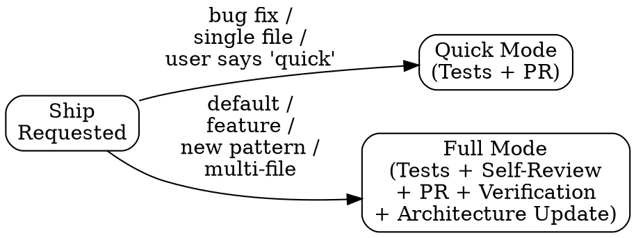
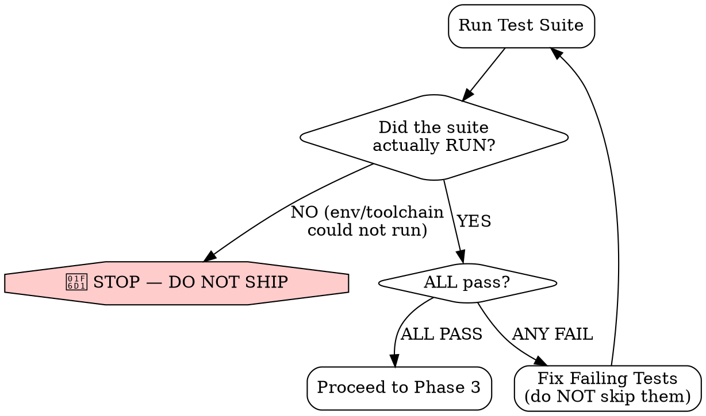
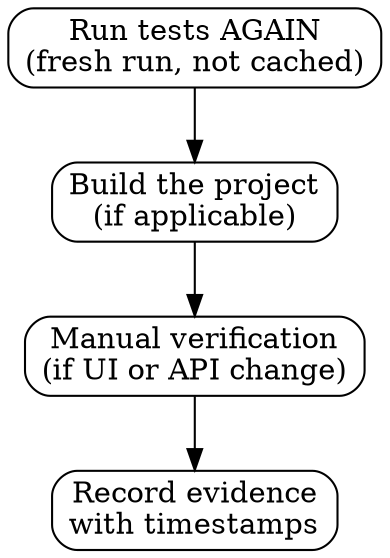

# Ship — Tests + Review + PR + Verification

You are executing a BEHAVIORAL CONTRACT. Every phase is MANDATORY.
Shipping is not pushing code. Shipping is delivering verified, reviewed, tested work through a structured process.

**NO SHIP CLAIMS WITHOUT FRESH VERIFICATION EVIDENCE.**

---

## Mode Selection



**Quick Mode** — Run tests, create PR with structured description. Use for bug fixes and single-file changes.
**Full Mode** — Tests, self-review, structured PR, fresh verification, and architecture update if needed. This is the DEFAULT.

---

## Phase 1: Coverage Check (MANDATORY — both modes)

If `.aid/COVERAGE.md` exists, check whether the files being shipped are in untested modules:

1. Read `.aid/COVERAGE.md`
2. Identify which modules the changed files belong to
3. Cross-reference against the Coverage by Module table
4. If ANY changed file is in a module marked **Coverage: None** or **Risk: HIGH**:

```
===========================================================
  WARNING: SHIPPING CHANGES TO UNTESTED MODULE
===========================================================
  Module: [module path]
  Coverage: None
  Risk: HIGH

  These files have ZERO test coverage. Any change here has
  no regression safety net. A bug introduced here will NOT
  be caught by tests.

  RECOMMENDATION: Add tests for this module before shipping.
  At minimum, add a smoke test covering the changed behavior.
===========================================================
```

5. If changed files are in modules with **Coverage: Partial**, note the gap:

```
NOTE: [module path] has partial coverage — [gap description from COVERAGE.md].
      Consider adding tests for the specific behavior you changed.
```

**This is a WARNING, not a blocker.** The ship proceeds, but the warning must be prominently visible in the Ship Report (Phase 9). Do not bury it.

If `.aid/COVERAGE.md` does not exist, note: "Coverage map not available — consider running `/aid-seed` or `/aid-init` to generate it."

---

## Phase 1.5: QA Verdict Check (MANDATORY for feature / multi-AC work)

For a feature or any change with more than one acceptance criterion, green tests are not
the same as **verified acceptance criteria** — that is `/aid-qa`'s job. Before shipping:

1. Look in `.aid/memory/` for a `type: qa` record covering this change.
2. Evaluate:
   - **QA record with `verdict: PASS`** → proceed; cite it in the Ship Report.
   - **QA record with `verdict: FAIL` or `BLOCKED`** → 🛑 STOP. Do not ship — the acceptance
     criteria are not met. Return to `/aid-qa` (or `/aid-plan` if the failure is a design gap).
   - **No QA record at all** for feature/multi-AC work → STOP and recommend running `/aid-qa`
     first: *"No QA verdict found. For feature work, run /aid-qa to verify acceptance criteria before shipping."* Proceed only on the user's explicit override.

A trivial single-behavior bug fix may skip this with a one-line note ("single-AC fix, QA
folded into Phase 2 tests"). Anything larger gets a real QA verdict.

---

## Phase 2: Run Tests — HARD GATE (MANDATORY — both modes)



**This is a HARD *behavioral* gate (enforced by this contract, not a hook — no hook runs
your tests). Tests that did not RUN GREEN are not a warning — they BLOCK the ship**, the
same posture as the Endor Critical/High gate in Phase 3. "Hard" means: you do not open a
delivery PR past this point until the suite ran green.

1. Identify the project's test command from `.aid/CONVENTIONS.md` or package.json / Makefile / etc.
2. Run the FULL test suite, not just tests for changed files.
3. **Evaluate the gate:**
   - **Tests could not be run** (missing toolchain, no DB, env limitation) → 🛑 **STOP. DO NOT SHIP.** Authoring tests is not the same as running them. State plainly: *"Tests could not be executed here ([reason]). Shipping is BLOCKED until they run green in an environment that can run them (CI or a real dev env)."* Hand off — do NOT open a PR that claims delivery.
   - **Any test fails** → FIX THEM and re-run. Do not proceed with failing tests.
   - **All tests pass** → proceed.
4. Record the test output:

```markdown
### Test Results
- **Command:** [exact command run]
- **Ran:** [YES — executed here / NO — could not run, reason]
- **Result:** [X passed, Y failed, Z skipped]
- **Failing tests:** [list, or "none"]
- **Coverage:** [if available]
```

If the project has no tests, STATE THAT EXPLICITLY and recommend adding them — and for any
non-trivial change, that is itself a blocker: add at least a smoke test before shipping.

Tests that were skipped or disabled are findings, not passes. Tests that were *written but
never executed* are NOT a pass — they are an open gate. The gate stays shut until green.

---

## Phase 3: Security Scan (MANDATORY — both modes)

If Endor Labs MCP is available, run a security scan before proceeding. This is the SAME
scan `aid-review` Phase 5b runs (defense in depth — caught earlier at review, confirmed
again at delivery); use the same tools so the two cannot give divergent verdicts:

1. Call `endor security_review` (`diff_type: local_changes`) or `endor scan` (with `path` +
   `scan_options.pr_incremental`) to check for vulnerabilities, malware, and secrets.
2. For dependency changes, call `endor check_dependency_for_risks` (includes malware) on each
   new/updated dependency.
3. Record findings:

```markdown
### Security Scan (Endor Labs)
- **Vulnerabilities:** [count, or "none found"]
- **Secrets detected:** [count, or "none"]
- **Dependency risks:** [count, or "clean"]
- **Critical findings:** [list, or "none"]
```

If Endor Labs MCP is NOT available, note: "Security scan skipped — Endor MCP not configured." and recommend manual review.

**Reachable Critical or High vulnerabilities MUST be addressed before shipping — no
exceptions. Confirmed secrets and malware (from `check_dependency_for_risks`) block
on detection, independent of reachability.** (Same bar as `aid-review` Phase 5b.)

---

## Phase 4: Self-Review (Full Mode — MANDATORY)

Execute the `review` skill against your own changes. Yes, review your own code.

**Scope: QUALITY ONLY.** Plan conformance was already adjudicated by the post-execute
`/aid-review` (its Phase 6.5) — do NOT re-run conformance from inside ship, and do NOT let
this self-review demote the plan or change RIPER state. In particular, QA-authored test
files (recorded in the QA record's `tests_authored:`) and `.aid/` records are cycle-owned
artifacts, never "deviations". If this quality pass DOES surface a genuine
built-≠-planned contradiction, STOP the ship and send it through /aid-review explicitly.

This is not theater. Self-review catches:
- Convention violations you internalized as "normal"
- Architecture drift you didn't notice while focused on implementation
- Security issues hidden in "obvious" code
- Missing error handling in happy-path code

Produce the full structured review output from the review skill. If the review finds Critical or Important findings, FIX THEM before proceeding.

```markdown
### Self-Review Summary
- **Verdict:** [PASS / FINDINGS FIXED / see details]
- **Convention compliance:** [all pass / findings fixed]
- **Architecture impact:** [none / documented below]
- **Findings fixed before shipping:** [list]
```

---

## Phase 5: Tribal Knowledge Check (MANDATORY — both modes)

Check `.aid/TRIBAL.md` for deployment-related tribal knowledge before creating the PR. Are there deployment windows to avoid? Customer-specific deployment requirements? Process steps that aren't automated? People who need to be notified?

If tribal knowledge applies to this change, include it in the PR description under a "Tribal Knowledge" section so reviewers see it. If the ship process itself reveals new tribal knowledge, add it to `.aid/TRIBAL.md` as part of this PR.

---

## Phase 6: Create PR with Structured Description (MANDATORY — both modes)

Create a pull request with this exact structure:

```markdown
## Summary
[1-3 bullet points describing WHAT changed and WHY]

## Changes
[Grouped by area/component, not just a file list]

### [Component/Area 1]
- [file] — [what changed and why]

### [Component/Area 2]
- [file] — [what changed and why]

## Architecture Impact
[None / description of how this affects system structure]
[Reference .aid/ARCHITECTURE.md if relevant]

## Convention Compliance
[Reviewed against .aid/CONVENTIONS.md — all rules pass]
[Or: specific notes on convention decisions]

## Testing
- **Test command:** [exact command]
- **Result:** [X passed, Y failed, Z skipped]
- **New tests added:** [yes/no — list if yes]
- **Coverage impact:** [if available]

## Verification
[How to verify this works — steps someone can follow]

## Related
- [Link to investigation in .aid/memory/ if this is a bug fix]
- [Link to plan in .aid/memory/ if this followed a plan]
- Jira: [PROJ-123 if a ticket is in scope — from the Jira Sync Protocol]
- [Link to relevant issues/tickets]
```

Do NOT create PRs with:
- Empty descriptions
- "See commits for details"
- Just a ticket number with no context
- "Bug fix" as the entire description

Use `gh pr create` with the structured body.

### Phase 6.5: Jira Sync — PR created (conditional — fail-open)

**Immediately after the PR is created** (so the link lands even if a later phase fails).
Follow `.claude/rules/aid-jira.md`; skip silently if `jira` is disabled/absent or the MCP is
unavailable — Jira NEVER blocks the ship.
- **Event:** `pr_created`
- **Default transition:** *comment-only*.
- **Comment payload:** the PR URL + a one-liner.

---

## Phase 7: Verify (Full Mode — MANDATORY)

**NO SHIP CLAIMS WITHOUT FRESH VERIFICATION EVIDENCE.**

After the PR is created, perform fresh verification:



1. **Run tests again** — not from cache, a fresh run
2. **Build the project** — if applicable, ensure it compiles/builds clean
3. **Manual verification** — if UI or API change, actually test the behavior
4. **Record evidence:**

```markdown
### Verification Evidence
- **Tests:** [passed at HH:MM — after PR creation]
- **Build:** [clean at HH:MM]
- **Manual check:** [description of what was verified]
- **Verified by:** [AI / AI + human]
```

"Tests passed earlier" is NOT verification evidence. The evidence must be FRESH — generated AFTER the PR is created, with timestamps.

---

## Phase 8: Architecture Update (Full Mode — when warranted)

If this change:
- Introduces a new pattern
- Modifies system boundaries
- Adds new external dependencies
- Changes data flow
- Adds new public interfaces

Then update `.aid/ARCHITECTURE.md` as part of this PR. The architecture doc must stay current. Including the architecture update in the shipping PR ensures it goes through review.

If unsure whether an update is needed, ask. But err on the side of updating.

---

## Phase 9: Final Ship Report (MANDATORY — both modes)

Produce the final structured output:

```markdown
## Ship Report

**What:** [one-line description]
**Mode:** Quick / Full
**PR:** [link]

### Checklist
- [x] Coverage check ([covered / partial / UNTESTED — see warnings])
- [x] Tests pass ([X] passed, [Y] failed, [Z] skipped)
- [x] / [ ] Self-review completed (Full Mode)
- [x] PR created with structured description
- [x] / [ ] Fresh verification evidence (Full Mode)
- [x] / [ ] Architecture updated (if needed)
- [x] / [ ] Investigation linked (if bug fix)
- [x] / [ ] Plan linked (if feature)
- [x] Ship record saved to memory

### Coverage Warnings
[from Phase 1 — list any modules with None or Partial coverage, or "All changed modules have test coverage"]

### Verification Evidence
[from Phase 7]

### Notes
[anything the reviewer should know]
```

---

## Phase 10: Save to Memory (MANDATORY — both modes)

**Every ship event gets recorded. No exceptions.**

A ship record captures what was delivered, how it was verified, and any findings from self-review. This is the project's delivery history — invaluable for future investigations, audits, and understanding when changes were introduced.

Save the ship record to `.aid/memory/`:

```markdown
---
date: YYYY-MM-DD
verified: YYYY-MM-DD
type: ship
target: [files/PR shipped]
pr: [PR URL]
mode: quick / full
confidence: high
related: [paths to related memory files, if any]
---

# Ship: [one-line description]

## What Shipped
- [summary of changes — grouped by component]

## Test Results
- **Command:** [exact command]
- **Result:** [X passed, Y failed, Z skipped]

## Security Scan
- [Endor Labs results, or "skipped — not configured"]

## Self-Review Findings (Full Mode)
- [findings fixed before shipping, or "clean — no findings"]

## Verification Evidence
- [timestamps and what was verified]

## Architecture Updates
- [what was updated in ARCHITECTURE.md, or "none needed"]
```

**Cross-link related memories:**
Check `.aid/memory/` for existing memories about the same files or feature. If found, add their paths to `related:` and update the existing memories to link back.

**Then update the compiled index:**
- Add a one-line entry to `.aid/MEMORY.md` under "Ships":
  ```
  - **Ship: [description] ([date])** — PR: [link], [test summary]. → memory/YYYY-MM-DD-[slug].md
  ```

After saving, state:
```
Ship record saved:
  Source: .aid/memory/YYYY-MM-DD-[slug].md
  Compiled: MEMORY.md updated
```

Over time, ship records create a delivery timeline — when bugs surface weeks later, the ship record tells you exactly what changed, what was tested, and what was verified. This is not ceremony. This is traceability.

### Phase 10.5: Jira Sync — shipped (conditional — fail-open)

**Only after the ship record is saved.** Follow `.claude/rules/aid-jira.md`; skip silently if
`jira` is disabled/absent or the MCP is unavailable — Jira NEVER blocks the ship.
- **Event:** `shipped`
- **Default transition:** `Release Management`.
- **EXPLICIT GUARD:** never fire `Release Ready` or `Done` — those are a whole-squad human
  decision (`guards.neverTransitionTo` enforces this; do not override it).
- **Comment payload:** the Build/Technical Summary — PR, tests, Endor scan result, verification
  evidence, and any coverage warnings.

---

## Phase 11: RIPER Teardown (MANDATORY — both modes)

**Ship is the END of the RIPER cycle. It owns the final state teardown — no other skill does this after ship.** Without it, PHASE=EXECUTE and the plan leak into the next session, blocking the next unrelated edit with a misleading gate error.

After the ship record is saved:

1. Check whether a RIPER cycle is in flight:
   ```bash
   ACTIVE_PLAN="$(bash .claude/hooks/scripts/riper-state.sh get ACTIVE_PLAN)"
   PHASE="$(bash .claude/hooks/scripts/riper-state.sh get PHASE)"
   ```
2. If `ACTIVE_PLAN` is set: resolve the plan and CHECK ITS STATUS FIRST — never claim a
   stamp you didn't make (a plan demoted by a DEVIATES review is `planned`, and the sed
   below would silently no-op on it):
   ```bash
   case "$ACTIVE_PLAN" in .aid/*) PLAN_FILE="${ACTIVE_PLAN}";; *) PLAN_FILE=".aid/${ACTIVE_PLAN}";; esac
   STATUS="$(awk 'NR==1 && /^---[[:space:]]*$/{f=1;next} f && /^---[[:space:]]*$/{exit} f && /^status:/{sub(/^status:[[:space:]]*/,""); print; exit}' "$PLAN_FILE" 2>/dev/null)"
   ```
   - `STATUS=approved` → stamp and VERIFY:
     ```bash
     sed -i.bak 's/^status:[[:space:]]*approved[[:space:]]*$/status: implemented/' "$PLAN_FILE" && rm -f "${PLAN_FILE}.bak"
     grep -q '^status:[[:space:]]*implemented' "$PLAN_FILE" && echo "plan stamped implemented" || echo "⚠ stamp FAILED — check $PLAN_FILE"
     ```
   - any other STATUS (e.g. `planned` after a DEVIATES demotion) → do NOT stamp, do NOT
     claim success. Report honestly: `⚠ plan was not approved at ship time (status: [X]) —
     shipped without stamping. Reconcile via /aid-plan → /aid-review before the record is
     trusted.`
3. Clear the workflow cursor either way (a leaked cursor walls the next session):
   ```bash
   bash .claude/hooks/scripts/riper-state.sh clear
   ```
4. Report what ACTUALLY happened: `RIPER cycle complete — [plan stamped implemented | plan
   NOT stamped (status was X)], state cleared.`

If there was no cycle in flight (PHASE=NONE, no ACTIVE_PLAN), skip silently — a standalone
Quick-Mode ship of ungated work needs no teardown.

---

## Rationalization Table

These are excuses you will want to make. They are all wrong.

| Excuse | Why It's Wrong |
|--------|---------------|
| "Tests pass, ready to ship" | Tests are Phase 2 of 10. Passing tests means you can START the ship process, not that you're done. Self-review first. |
| "I wrote the tests, they look right, I'll ship" | Writing a test is not running it. A test you never executed is an OPEN GATE, not a pass. If you can't run it here, shipping is BLOCKED — hand off to CI / a real env. No exceptions. |
| "The toolchain isn't available here, I'll ship anyway and CI will catch it" | No. Phase 2 is a hard gate. If tests can't run, you do not open a delivery PR — you stop and say so. "CI will catch it" is how broken code reaches a reviewer's plate. |
| "I'll add a PR description later" | No you won't. The PR description is part of shipping. A PR without a description is an unfinished delivery. |
| "The build takes too long to run again" | Verification is not optional. If the build is slow, that's a separate problem to fix. Ship correctly now. |
| "It's a one-line fix, no need for full ship" | Quick Mode exists for this. But Quick Mode still runs tests and creates a structured PR. One-line fixes cause production incidents. |
| "I already verified it works" | When? Show the evidence. "I checked earlier" is not verification. Fresh evidence with timestamps or it didn't happen. |
| "Nobody reads PR descriptions" | They will when the descriptions are consistently structured and useful. Lead by example. The bar rises when you refuse to lower it. |
| "The architecture hasn't changed" | Are you sure? Check against ARCHITECTURE.md. If you introduced a new pattern, added a dependency, or changed data flow — it changed. |
| "I'll update the architecture doc in a follow-up" | Follow-up architecture updates never happen. Do it now, in this PR, or it rots. |
| "Self-review is redundant, I wrote the code" | Self-review catches different things than implementation focus. When you're building, you're thinking about behavior. When you're reviewing, you're thinking about correctness, consistency, and maintainability. Different lenses. |
| "No need to save the ship record" | WRONG. When a bug surfaces in 3 weeks, the ship record is the first place you look. What changed? What was tested? What was verified? Without it, you re-investigate from scratch. |
| "State cleanup is someone else's job" | It is YOURS. Ship ends the RIPER cycle. Skipping Phase 11 leaks PHASE=EXECUTE + a stale plan into the next session, and the next unrelated edit gets walled with a confusing error. Stamp implemented, clear state — every shipped cycle. |
| "Jira is down, skip the sync AND the ship record" | Wrong — memory is authoritative. Save the ship record, log the Jira skip, continue. And NEVER fire Release Ready / Done — those are a whole-squad human decision. |

---

## Contract

By executing this skill, you agree:

1. You will run the full test suite before shipping — no partial runs — and you will treat un-run or failing tests as a HARD BLOCK, never opening a delivery PR until they run green
2. You will self-review your code against conventions (Full Mode)
3. You will create PRs with the structured description format — always
4. You will provide fresh verification evidence with timestamps (Full Mode)
5. You will update ARCHITECTURE.md when warranted
6. You will link to investigations and plans in the PR when applicable
7. You will NEVER claim "shipped" without completing all mandatory phases
8. You will produce the Ship Report — every time
9. You will save the ship record to memory — every time
10. You will run the RIPER teardown (Phase 11) — stamp the plan `implemented` and clear `.riper-state` — whenever a cycle was in flight
11. You will sync gates to Jira when configured — and never let Jira block the work, and never fire Release Ready / Done
